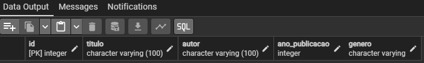
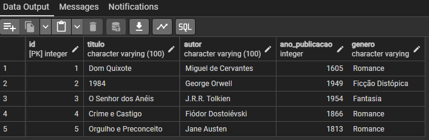

# Primeiro Projeto de Banco de Dados - SQL/PostgreSQL

Desenvolvimento de Primeiro Projeto de Banco de Dados com SQL/PostgreSQL. Exercício 01, Módulo 01 (SQL). 

Instituição: [Digital College Brasil](https://digitalcollege.com.br/) (Fortaleza/CE) <br>
Curso: Data Analytics (Turma 18) <br>
Instrutora: [NayaraWakweski](https://github.com/NayaraWakewski) <br>

<br>

## Etapas de Desenvolvimento

### 1ª Etapa
- Criar o banco de dados: biblioteca (Através da interface gráfica).

<br>

### 2ª Etapa
- Criar a tabela: livros.
```
CREATE TABLE IF NOT EXISTS public.livros (
    id serial NOT NULL,
    titulo character varying (100),
    autor character varying (100),
    ano_publicacao integer,
    genero character varying,
    CONSTRAINT livros_pkey PRIMARY KEY (id)
);    
```

- Checar as colunas e tipos de dados que foram criados.
```
SELECT * FROM public.livros;
```

- Visualização <br>


<br>

### 3ª Etapa
- Inserir valores na tabela: livros.
```
INSERT INTO public.livros (titulo, autor, ano_publicacao, genero) VALUES 
    ('Dom Quixote', 'Miguel de Cervantes', 1605, 'Romance'),
    ('1984', 'George Orwell', 1949, 'Ficção Distópica'),
    ('O Senhor dos Anéis', 'J.R.R. Tolkien', 1954, 'Fantasia'),
    ('Crime e Castigo', 'Fiódor Dostoiévski', 1866, 'Romance'),
    ('Orgulho e Preconceito', 'Jane Austen', 1813, 'Romance');
```

- Checar valores inseridos na tabela: livros.
```
SELECT * FROM public.livros;
```

- Visualização <br>


## Meus Contatos

- Business Card - [Renato Albuquerque](https://rma-contacts.vercel.app/)
- Linkedin - [renato-malbuquerque](https://www.linkedin.com/in/renato-malbuquerque/)
- Discord - [Renato Albuquerque#0025](https://discordapp.com/users/992621595547938837)
